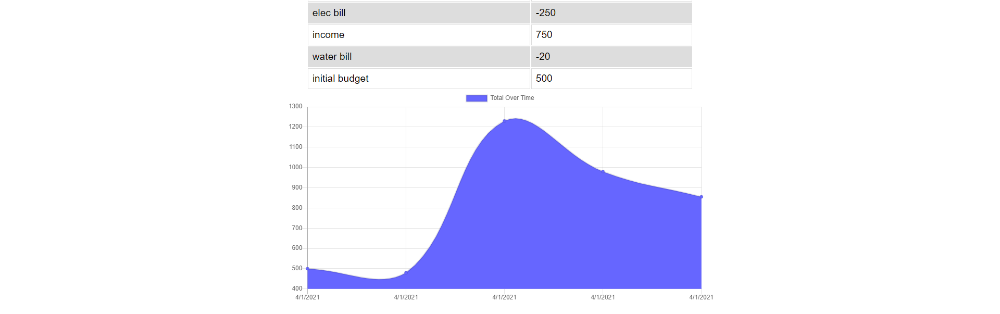

# Progress Web App - Budget Tracker
## Table of Contents
> - [Description](#Description)
> - [Table of Contents](#Table-of-Contents)
> - [Installation](#Installation)
> - [Usage](#Usage)
> - [License](#License)
> - [Contributing](#Contributing)
> - [Tests](#Tests)
> - [Questions](#Questions)

## Description
Mongo / Mongoose, Node, Express powered webapp for tracking income and expense.

* [View the deployed app on Heroku](https://floating-cliffs-70230.herokuapp.com/)
* [View it on GitHub](https://github.com/FSC-Portfolio/pwa-budget-tracker)

## Installation
Clone the repo, navigate to the root folder, run npm install, ensure you have mongodb installed and configured.
## Usage
Add to the budget on or offline.
## License
This application is covered under the MIT license.
## Contributing
Please report any bugs :)
## Tests
No tests required.
## Questions
Please refer any questions to  via jayarghargh@gmail.com.

>  This README.md created with .

